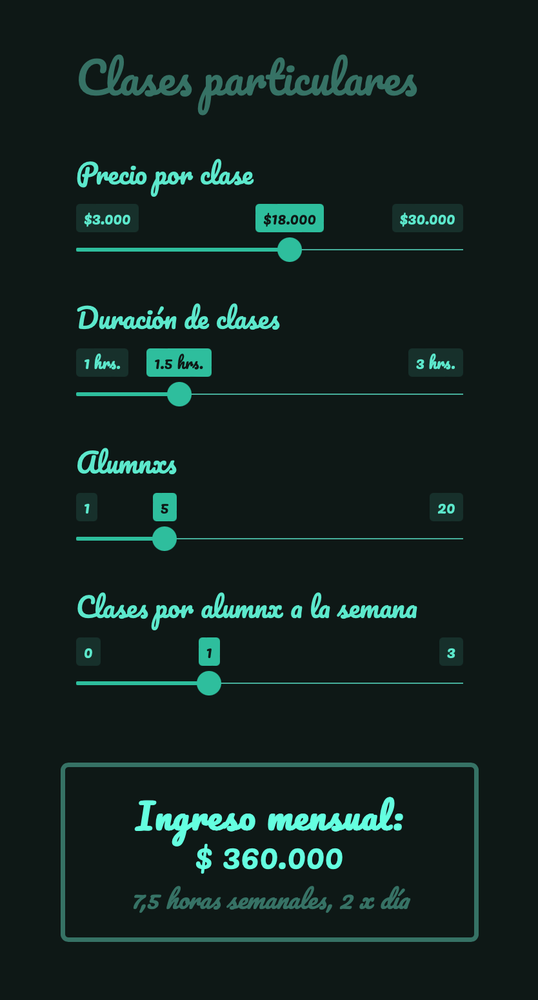

# Estimador de ingresos por clases particulares

App sencilla que permite planificar un aproximado de ingresos mensuales haciendo clases particulares, definiendo el precio cobrado por clase, la duración de las clases, la cantidad de alumnas/os que tengas, y un aproximado de cuántas clases semanales toman tus alumnos/as. También entrega la cantidad de horas semanales que tendrías que dedicar a las clases, y cuántas tendrías que hacer por día.

Aplicación desarrollada en R en solo 129 líneas de código. Depende de los paquetes `{shiny}` para aplicaciones web interactivas, `{htmltools}` para simplificar el uso de estilos CSS, `{bslib}` para aplicar temas de colores a aplicaciones Bootstrap, y `{shades}` para modificar paletas de colores de forma programática.

